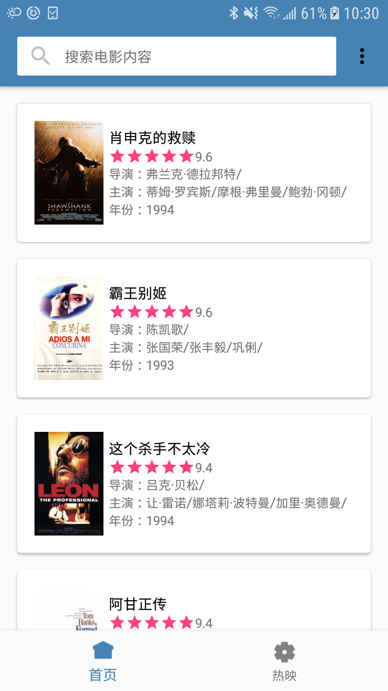
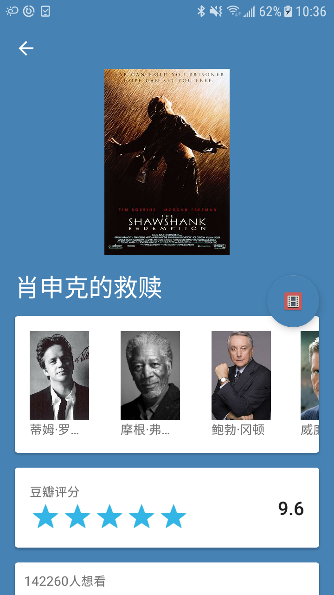

# KotlinDouban
用Kotlin写的豆瓣电影App

- ## 由来
  最新工作比较轻松，闲的无事，就想着通过一个项目来回顾一下Kotlin的基础点，于是写了这个Retrofit+okhttp+rxjava豆瓣电影的App。

- ## 功能
  - 电影TOP250
  - 电影搜索
  - 正在热映的电影，支持城市切换

- ## 预览
  <p>
  
  
  
  </p>

- ## 接口
```
https://api.douban.com
https://api.douban.com//v2/movie/top250?start={start}&count={count}
https://api.douban.com//v2/movie/search?q={q}
https://api.douban.com//v2/movie/celebrity/{id}
https://api.douban.com//v2/movie/celebrity/{id}
https://api.douban.com//v2/movie/subject/{id}
https://api.douban.com/v2/movie/in_theaters?city={city}&start={start}&count={count}
```
